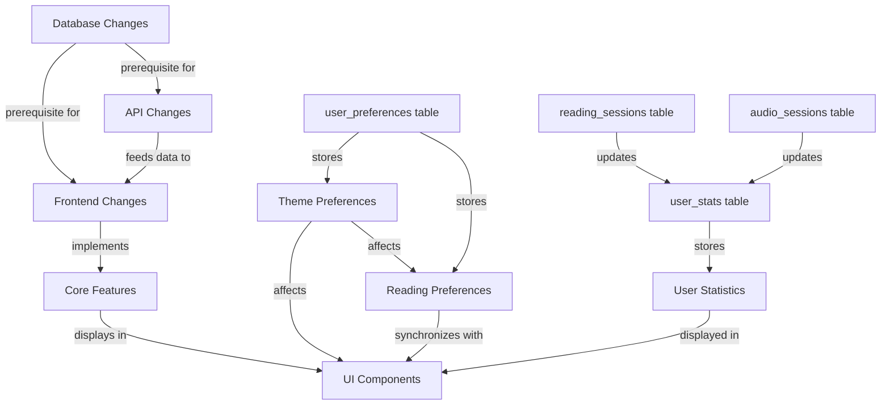

# User Preferences Migration Plan

## Dependency Relationships

**Implementation Order:**

1. Database schema changes (✅ completed)
2. API routes update
3. Frontend hooks implementation
4. Theme preferences synchronization
5. Reading preferences synchronization
6. User statistics integration
7. UI Components update

## Phase 1: Remove Current Implementation

### Database Changes

[x] Create migration script to:

-   [x] Drop current `user_preferences` table
-   [x] Create new `user_preferences` table with simplified schema
-   [x] Create new `user_stats` table
-   [x] Back up existing preferences data

### API Changes

[ ] Update `/api/user/preferences` route to:

-   [x] Remove legacy fields
-   [x] Implement new simplified schema
-   [ ] Add stats endpoint `/api/user/stats` (read-only)
-   [ ] Remove any unused API endpoints related to old preference system

### Frontend Changes

[ ] Update `useUserPreferences` hook to:

-   [ ] Remove references to legacy fields
-   [ ] Add stats fetching capability
-   [ ] Implement new simplified preference structure

### Code Cleanup

[ ] Remove deprecated code:

-   [ ] Delete unused components from previous implementation
-   [ ] Remove legacy preference handling in components
-   [ ] Clean up imports referencing old preference structure
-   [ ] Ensure no references to removed database fields remain

## Phase 2: Implement New System

### Core Features

[ ] Theme preferences:

-   [ ] Light/dark/system toggle
-   [ ] Persistence across sessions
-   [ ] Apply theme to both website and PageReader

**Theme Implementation Notes:**

-   Currently, theme settings (light/dark/system) only affect the website but not the PageReader
-   Update `theme-provider.tsx` to ensure theme changes are applied to PageReader as well
-   Ensure theme preferences are synchronized across all components and persisted in both localStorage and database (user_preferences table)

[ ] Reading preferences:

-   [ ] View mode (single/double page)
-   [ ] Zoom level control (100% default)
-   [ ] Synchronize settings between Settings page and Reader

**Reading Preferences Implementation Notes:**

-   "Zoom Level" exists in both settings page (`src/app/settings/page.tsx`) and PageReader (`OptionsSidebar.tsx`)
-   "View Mode" exists in PageReader (`OptionsSidebar.tsx`)
-   Update settings page (`src/app/settings/page.tsx`) "Lettura" tab to:
    1. Add "View Mode" and "Zoom Level" controls just before "Dimensione carattere"
    2. Keep but disable the "Dimensione carattere" controls
-   Both pages (settings and OptionsSidebar) must share the same settings (changes on one page must be reflected on the other)

[ ] User statistics:

-   [ ] Books read counter
-   [ ] Last read date tracking
-   [ ] Audiobooks listened counter
-   [ ] Integration with existing reading_sessions and audio_sessions tables

**User Statistics Implementation Notes:**

-   Leverage existing tables for tracking:
    -   `reading_sessions` - tracks books opened by users
    -   `audio_sessions` - tracks audiobooks opened by users
-   Implementation logic:
    1. When a user opens a book/audiobook, check if the user_id/book_id pair exists in the respective table
    2. If it doesn't exist (first time opening):
        - Increment the counter in `user_stats` (total_books_read or total_audiobooks_listened)
        - Add a new row to `reading_sessions` or `audio_sessions`
    3. If it exists, only update relevant statistics (e.g., date field)
-   Initially don't use these columns to simplify implementation:
    -   For `reading_sessions`: start_page, end_page, duration
    -   For `audio_sessions`: start_time, end_time, duration

### UI Components

[ ] Settings page:

-   [ ] Simplify preferences panel
-   [ ] Add stats display section

[ ] Reader toolbar:

-   [ ] Add zoom controls
-   [ ] Add view mode toggle
