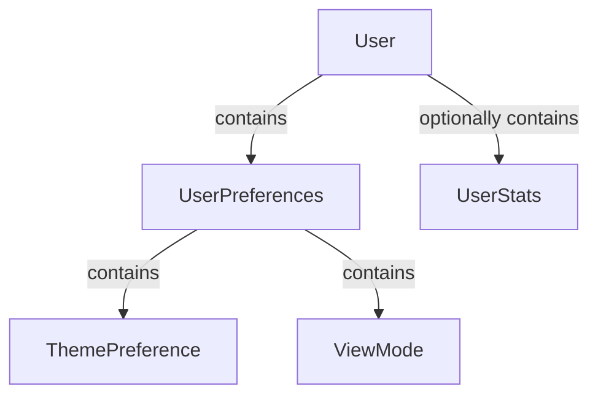
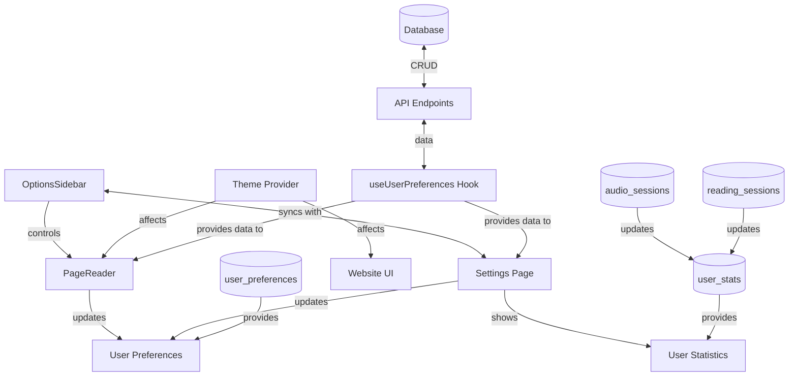

# User Preferences Documentation

## New Simplified System (Proposed Implementation)

### Core Requirements

1. **Aspect Preferences**

```typescript
{
    theme: 'light' | 'dark' | 'system';
}
```

2. **Reader Preferences**

```typescript
{
    viewMode: 'single' | 'double';
    zoomLevel: number; // Percentage (e.g. 100 for 100%)
}
```

3. **User Statistics**

```typescript
interface UserStats {
    totalBooksRead: number;
    lastReadDate: string; // ISO format
    totalAudiobooksListened: number;
    lastListenedDate: string; // ISO format
}
```

### Implementation Approach

1. **Database Schema**

```sql
CREATE TABLE "user_preferences" (
  user_id INTEGER PRIMARY KEY REFERENCES users(id),
  theme TEXT NOT NULL DEFAULT 'system',
  view_mode TEXT NOT NULL DEFAULT 'double',
  zoom_level INTEGER NOT NULL DEFAULT 100
);

CREATE TABLE "user_stats" (
  user_id INTEGER PRIMARY KEY REFERENCES users(id),
  total_books_read INTEGER DEFAULT 0,
  last_read_date TEXT,
  total_audiobooks_listened INTEGER DEFAULT 0,
  last_listened_date TEXT
);

-- Existing tables used for tracking user reading/listening activity
CREATE TABLE "reading_sessions" (
  id INTEGER NOT NULL,
  user_id INTEGER NOT NULL,
  book_id TEXT NOT NULL,
  start_page INTEGER NOT NULL,
  end_page INTEGER NOT NULL,
  duration INTEGER NOT NULL,
  date TEXT NOT NULL
);

CREATE TABLE "audio_sessions" (
  id INTEGER NOT NULL,
  user_id INTEGER NOT NULL,
  book_id TEXT NOT NULL,
  start_time INTEGER NOT NULL,
  end_time INTEGER NOT NULL,
  duration INTEGER NOT NULL,
  date TEXT NOT NULL
);
```

2. **TypeScript Types**

```typescript
type ThemePreference = 'light' | 'dark' | 'system';
type ViewMode = 'single' | 'double';

// Core User type - matches src/types/index.d.ts
export interface User {
    id: string; // Unique user identifier
    email: string; // User's email address
    fullName: string; // User's full name
    isActivated: boolean; // Account activation status
    preferences: UserPreferences; // All user settings
    stats?: UserStats; // Optional reading statistics
}

// Preferences structure - used across components
export interface UserPreferences {
    theme: ThemePreference; // UI color scheme
    reading: {
        viewMode: ViewMode; // Book display format
        zoomLevel: number; // View magnification (100% = normal)
    };
}

// Reading statistics - tracked per user
export interface UserStats {
    totalBooksRead: number; // Lifetime book count
    lastReadDate: string; // ISO date of last reading
    totalAudiobooksListened: number; // Lifetime audiobook count
    lastListenedDate: string; // ISO date of last listening
}
```

3. **Type Relationships**



4. **Component Dependencies**



5. **Implementation Notes**

-   Preferences are persisted via PATCH to `/api/user/preferences`
-   Stats are read-only and updated by backend services
-   All dates use ISO 8601 format (YYYY-MM-DD)
-   Zoom level and view mode (single or double page) persist across sessions via localStorage

6. **Reading Preferences Synchronization**

-   "Zoom Level" exists in both settings page (`src/app/settings/page.tsx`) and PageReader (`OptionsSidebar.tsx`)
-   "View Mode" exists in PageReader (`OptionsSidebar.tsx`)
-   Settings page (`src/app/settings/page.tsx`) "Lettura" tab must be updated to:
    1. Add "View Mode" and "Zoom Level" controls just before "Dimensione carattere"
    2. Keep but disable the "Dimensione carattere" controls
-   Both pages (settings and OptionsSidebar) must share the same settings (changes on one page must be reflected on the other)
-   Changes should be synchronized through the `useUserPreferences` hook

7. **Theme Synchronization**

-   Currently, theme settings (light/dark/system) only affect the website but not the PageReader
-   The `theme-provider.tsx` component needs to be updated to ensure theme changes are applied to both the website and PageReader
-   Theme preferences should be persisted in both localStorage and database (user_preferences table)
-   The PageReader component needs to be modified to respond to theme changes from the `useTheme` hook
-   Implement a consistent theme application mechanism across all components

8. **User Statistics Tracking**

-   Two existing tables are used to track user activity: `reading_sessions` and `audio_sessions`
-   These tables track which books/audiobooks a user has opened
-   Implementation approach:
    1. When a user opens a book/audiobook, check if a record exists in the respective table for that user_id/book_id pair
    2. If no record exists (first time opening):
        - Increment the counter in `user_stats` table (total_books_read or total_audiobooks_listened)
        - Add a new row in `reading_sessions` or `audio_sessions`
    3. If a record exists, just update the relevant statistics (e.g., date)
-   Simplified implementation: Some columns won't be used initially
    -   For `reading_sessions`: start_page, end_page, duration
    -   For `audio_sessions`: start_time, end_time, duration
-   This approach allows tracking unique books read/listened by each user

---

## Replacement Strategy

### Clean Cut-Over Approach

- The new simplified system will **completely replace** the previous implementation
- No migration or transition period is required as:
  - No existing user data needs to be preserved
  - System is not yet in production
  - Direct replacement is the simplest approach
- All components from the old system should be removed immediately

### Code Cleanup Guidelines

1. **Identify Deprecated Files:**
   - Use the inactive files list below to identify components for removal
   - Remove all references to these files throughout the codebase

2. **Clean Implementation:**
   - Implement the new system without backward compatibility concerns
   - Remove old code as part of the implementation, not as a separate phase
   - Ensure all new type definitions accurately reflect the new structures

## Current System (Legacy Implementation: to be removed)

### Overview

The current system handles preferences across these categories:

-   Theme preferences
-   View modes
-   Email notifications
-   Accessibility options
-   Reading preferences

### Core Architecture

#### Database Schema

```sql
CREATE TABLE "user_preferences" (
    "user_id" INTEGER NOT NULL,
    "theme" TEXT NOT NULL DEFAULT 'system',
    "view_mode" TEXT NOT NULL DEFAULT 'grid',
    "email_new_releases" BOOLEAN NOT NULL DEFAULT TRUE,
    "email_reading_reminders" BOOLEAN NOT NULL DEFAULT TRUE,
    "email_recommendations" BOOLEAN NOT NULL DEFAULT TRUE,
    "reduce_animations" BOOLEAN NOT NULL DEFAULT FALSE,
    "high_contrast" BOOLEAN NOT NULL DEFAULT FALSE,
    "large_text" BOOLEAN NOT NULL DEFAULT FALSE,
    "font_size" TEXT NOT NULL DEFAULT 'medium',
    "line_spacing" TEXT NOT NULL DEFAULT 'normal',
    "font_family" TEXT NOT NULL DEFAULT 'inter',
    PRIMARY KEY("user_id"),
    FOREIGN KEY("user_id") REFERENCES "users"("id") ON DELETE CASCADE
);
```

#### Type Definitions

```typescript
export interface UserPreferences {
    theme: 'light' | 'dark' | 'system';
    viewMode: 'grid' | 'list';
    emailNotifications: {
        newReleases: boolean;
        readingReminders: boolean;
        recommendations: boolean;
    };
    accessibility: {
        reduceAnimations: boolean;
        highContrast: boolean;
        largeText: boolean;
    };
    reading: {
        fontSize: 'small' | 'medium' | 'large' | 'x-large';
        lineSpacing: 'tight' | 'normal' | 'relaxed';
        fontFamily: 'inter' | 'merriweather' | 'roboto' | 'openDyslexic';
    };
}
```

### Implementation

#### Active Components

1.  **Preferences Hook** (`use-user-preferences.ts`)

    -   Manages local state of preferences
    -   Provides methods to update preferences
    -   Handles synchronization with server

2.  **Settings Page** (`src/app/settings/page.tsx`)

    -   Provides UI for modifying preferences
    -   Organized in tabs for different preference categories
    -   Handles preference change events

3.  **API Endpoints**

    -   GET: Retrieves current preferences
    -   PATCH: Updates preferences

4.  **Reader-Specific Preferences** (`OptionsSidebar.tsx`)

    -   Controls for reading experience (font size, spacing, etc.)
    -   Saved per-book in localStorage

5.  **Theme Management** (`theme-provider.tsx`)
    -   Handles theme switching
    -   _Note: Currently only affects website UI, not PageReader (needs to be updated)_

### Inactive Components

-   `SettingsCard` (`src/components/settings/settings-card.tsx`)
-   `SettingsSelectItem` (`src/components/settings/settings-select-item.tsx`)
-   `SettingsToggleItem` (`src/components/settings/settings-toggle-item.tsx`)

---

## File Reference

### Active Files

1.  `src/types/index.d.ts` - UserPreferences interface
2.  `src/hooks/use-user-preferences.ts` - Preferences hook
3.  `src/app/api/user/preferences/route.ts` - Preferences API
4.  `src/app/settings/page.tsx` - Settings page
5.  `src/app/read-book/[book_id]/OptionsSidebar.tsx` - Reader preferences
6.  `src/components/theme-provider.tsx` - Theme management
7.  `src/context/auth-context.tsx` - Auth/Preferences context
8.  `src/app/read-book/[book_id]/useReaderTheme.ts` - Reader theme hook
9.  `src/providers/providers.tsx` - Theme provider wrapper
10. `src/components/settings/settings-nav.tsx` - Settings navigation
11. `db/schema.sql` - Database schema
12. `db/dump-postgreSQL.sql` - PostgreSQL schema
13. `src/components/theme-switcher.tsx` - Theme switching UI
14. `src/types/context.d.ts` - Context type definitions

### Inactive Files

1.  `src/components/settings/settings-card.tsx`
2.  `src/components/settings/settings-select-item.tsx`
3.  `src/components/settings/settings-toggle-item.tsx`

### Partially Implemented Files

1.  `src/lib/user-db.ts` - User preferences loading
2.  `src/lib/user-db-simple.ts` - Simplified user preferences

---

## Optimization Suggestions

1.  **Storage Optimization**

    -   Combine reading preferences into JSONB column if using PostgreSQL
    -   Consider localStorage for temporary reader settings

2.  **Performance Improvements**

    -   Batch preference updates
    -   Implement debounced saving for frequent changes (like font size)

3.  **Future Extensibility**

    -   Use versioned preferences structure
    -   Add migration system for preference changes

4.  **Analytics Potential**

    -   Track preference adoption rates
    -   Add anonymous usage statistics

5.  **UI Considerations**

    -   Progressive enhancement for accessibility features
    -   Context-aware defaults (e.g. mobile vs desktop)

---

## Feature Matrix

| Feature             | Status      | Location                    |
| ------------------- | ----------- | --------------------------- |
| Theme Switching     | ✅ Active   | `theme-provider.tsx`        |
| View Modes          | ✅ Active   | `src/app/settings/page.tsx` |
| Reading Preferences | ✅ Active   | `OptionsSidebar.tsx`        |
| Email Notifications | ⚠️ Partial  | `db/schema.sql`             |
| Push Notifications  | ❌ Inactive | -                           |
| High Contrast Mode  | ❌ Inactive | `db/schema.sql`             |
